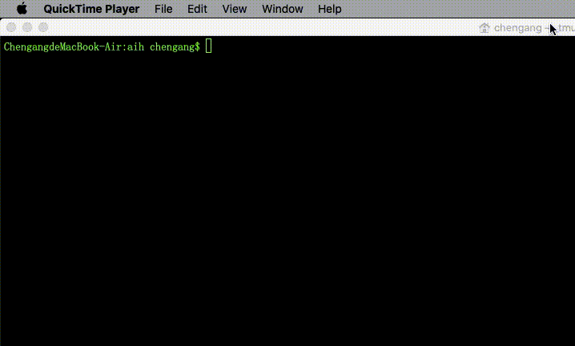

# Talk to AI modes in terminal.



## Usage
Download [binary file](https://github.com/Databingo/aih/releases) then type:
```bash
./aih
```
## Command list
| Command    | Operation|
|------------|----------|
|.           | Select AI mode of Bard/ChatGPT/Claude2/HuggingChat(Llama2)|
|↑           | Previous input|
|↓           | Next input|
|<<          | Start multiple lines input mode|
|>>          | End multiple lines input mode|
|j           | Scroll down|
|k           | Scroll up|
|f           | Page down|
|p           | Page up|
|g           | Scroll to top|
|G           | Scroll to bottom|
|q or Enter  | Back to conversation|
|.c or .clear| Clear the screen|
|.h or .history | Show history of conversations|
|.proxy      | Set proxy, for example: socks5://127.0.0.1:7890|
|.help       | Show help|
|.exit       | Exit Aih|

## Prerequisites
- [Chrome Browser](https://google.com/chrome)
- Free account of [Bard](https://bard.google.com), [Claude](https://claude.ai), [OpenAI](https://chat.openai.com), [HuggingChat](https://huggingface.co/chat) logged-in manually on your Chrome browser.
- (Optional) Paid ChatGPT API on [Billing](https://platform.openai.com/account/billing/overview). 

## Tips
- Close Chrome browser before run Aih at the first time.
- More usage of command [Liner](https://github.com/peterh/liner#line-editing).
- Answer will be auotmatically saved in system clipboard for pasting.
- Conversations were persisted in `history.txt` beside Aih binary.
- `./aih -rod=show` to monitor in browser.
- All-In-One mode will display answers from all the AI modes.


## Supported OS
- Mac/Linux/Windows

## Installation
```
$ git clone https://github.com/Databingo/aih
$ go clean -cache && go clean -modcache 
$ cd aih/ryy && go mod tidy && go build -o ../vi && cd ..
$ go mod tidy && go build -tags vi
```
## Acknowledgements
- github.com/rivo/tview
- github.com/peterh/liner
- github.com/gdamore/tcell/v2
- github.com/atotto/clipboard
- github.com/go-rod/rod
- github.com/go-rod/stealth
- github.com/tidwall/gjson
- github.com/tidwall/sjson
- github.com/manifoldco/promptui
- github.com/sashabaranov/go-openai 

## License
MIT and "You can choose not to include this MIT license into your copies".
