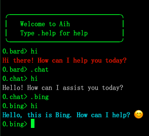

# Aih: use ChatGPT, GoogleBard, BingChat in terminal. 



## Usage
```bash
./aih
```
## Command list
|command   | operation|
|----------|----------|
|.bard      | Bard|
|.bing      | Bing Chat|
|.chat      | ChatGPT Web (free)|
|.chatapi   | ChatGPT Api (pay) |
|.proxy     | Set proxy for example socks5://127.0.0.1:7890|
|<<         | Start multiple lines input model|
|>>         | End multiple lines input model|
|↑          | Previous input value|
|↓          | Next input value|
|.new       | New conversation of ChatGPT|
|.speak     | Voice speak context(macos)|
|.quiet     | No speak |
|.bardkey   | Set GoogleBard cookie|
|.bingkey   | Set BingChat cookie|
|.chatkey   | Set ChatGPT Web accessToken|
|.chatapikey| Set ChatGPT Api key|
|.clear     | Clear screen|
|.help      | Help|
|.exit      | Exit|

## Pre-requests
- For ChatGPT Web (free) you should have an `account` and a logined `accessToken` from [OpenAI](https://chat.openai.com/api/auth/session).
- For ChatGPT API (pay) you should have a payed API on [Billing](https://platform.openai.com/account/billing/overview). 
- For GoogleBard you should [Join Waitlist](https://bard.google.com) and a cookie value of `__Secure-lPSID`.
- For BingChat you should [Apply Waitlist](https://bing.com/new) and a `cookie`.

## How to get Cookies
- For GoogleBard cookie you could login then add [Cookie-Editor](https://cookie-editor.cgagnier.ca) extension then Click it on the right-top corner to copy `__Secure-lPSID` value.
- For BingChat cookie you could login then use Cookie-Editor -> click Cookie-Editor icon -> click "Export" -> click "Export as JSON" (This saves your cookies to clipboard), then type `.bing` in Aih, when you type in something then hit Enter, you will see a prompt **"Please type << then paste Bing cookie then type >> then press Enter"**, by doing so you could set BingChat cookie via multiple lines input model.

## Support OS
- Mac
- Linux
- Windows

## Installation
```bash
$ git clone https://github.com/Databingo/aih
$ go clean -cache && go clean -modcache 
$ cd aih && go mod tidy && go build 
```
## About Suggestions
This is an open plan based on the idea of "Co-relation's enhancement of AI and human beings".
If you have any suggestions please write in Issues.

## Acknowledge
- github.com/rocketlaunchr/google-search
- github.com/sashabaranov/go-openai 
- github.com/CNZeroY/googleBard
- github.com/pavel-one/EdgeGPT-Go
