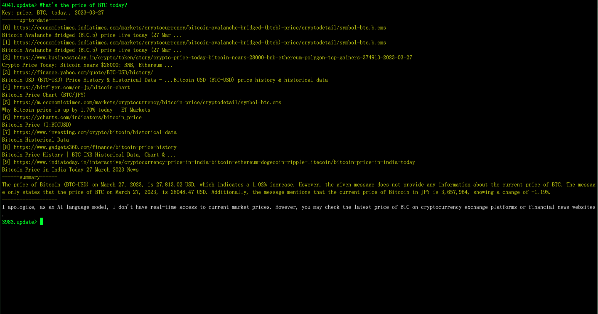

# Aih: up-to-date ChatGPT

Use ChatGPT-3.5-turbo in terminal with contextual sensitivity + UP-TO-DATE dataset.




## Up-to-date feature:
In `.update` model Aih will use ChatGPT to 
1. Summarise key words from your question fit for search engine;
2. Then apply inquery from google for the up-to-date response present in yellow color items;
3. Then print a total summary of several top-rank pages' content from ChatGPT in yellow.

## Command list
|command   | operation|
|----------|----------|
|.help      | Show help|
|.key       | Set key|
|.proxy     | Set proxy for example: socks5://127.0.0.1:7890|
|.new       | New conversation|
|.speak     | Voice speak context|
|.quiet     | Quiet not speak |
|.clear     | Clear screen|
|.update    | Inquery up-to-date dataset|
|.exit      | Exit|
|-----------|----------|
|.prompt    | Role of Assistant for create precise prompt|
|.writer    | Role of Checker for create well sentences|

## Usage
```bash
./aih
```
1. Paste you OpenAI key from the terminal the first time you run aih;
2. Type .proxy to set proxy if you need;
3. It automatic start with conversation mode.
4. The number in prompt is the left tokens in this conversation.

Current functions:
1. Escape the frequent "An error occurred" of OpenAI's website.
2. Automatic voice reading AI returns text. 
3. Assist you create precise prompt sequentially by type .prompt
4. Assist you create well-expressed sentences sequentially by type .writer
5. Inquery up-to-date dataset by type .update

## Support OS
- Mac
- Linux

## Installation
```bash
$ git clone https://github.com/Databingo/aih
$ cd aih && go mod tidy && go build 
```

## Todo
1. Tidy code.
2. ~More roles such as cowriter?~

## About Suggestions
This is an open plan based on the idea of "Co-relation's enhancement of AI and human beings".
If you have any suggestions please write in Issues.


