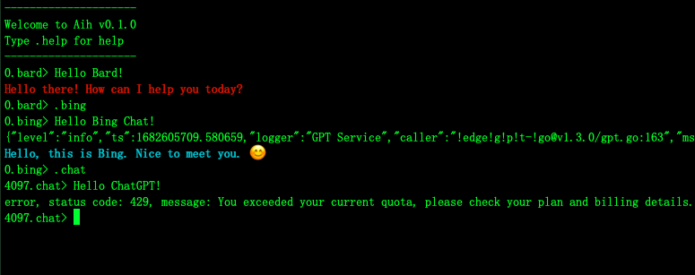

# Aih: Talk with Bard/Bing/ChatGPT/Claude in the terminal.



## Usage
Download [binary file](https://github.com/Databingo/aih/releases) then type:
```bash
./aih
```

## Command list
| Command    | Operation|
|------------|----------|
|.bard       | Google Bard|
|.bing       | Bing Chat|
|.chat       | ChatGPT Web (free)|
|.chatapi    | ChatGPT API (pay) |
|.chatapi*.*   | Set ChatGPT API mode such as GPT3Dot5Turbo(default), GPT4, GPT432K|
|.claude     | Claude (in Slack) |
|.proxy      | Set proxy, for example: socks5://127.0.0.1:7890|
|<<          | Start multiple lines input mode|
|>>          | End multiple lines input mode|
|↑           | Previous input value|
|↓           | Next input value|
|.new        | Start a new conversation on ChatGPT|
|.speak      | Voice speak context(macOS only)|
|.quiet      | Disable voice output |
|.bardkey    | Set Google Bard cookie|
|.bingkey    | Set Bing Chat cookie|
|.chatkey    | Set ChatGPT Web access token|
|.chatapikey | Set ChatGPT API key|
|.claudekey  | Set Claude Slack key|
|.clear or .c| Clear the screen|
|.help       | Show help|
|.exit       | Exit Aih|

## Prerequisites
- For ChatGPT Web (free) you should have a free account to obtain a logged-in `accessToken` from [OpenAI](https://chat.openai.com/api/auth/session).
- For ChatGPT API (paid) you should have a paid API on [Billing](https://platform.openai.com/account/billing/overview). 
- For Google Bard, you should have a free [Google account](https://account.google.com) to obtain a cookie value of `__Secure-lPSID`.
- For Bing Chat, you need to have a free [Microsoft account](https://account.microsoft.com) in order to obtain a cookie.
- For Claude, you need a [Slack account](https://slack.com/get-started#/createnew) to [add Claude](https://www.anthropic.com/claude-in-slack) for a `channel_id`, then create an app to get your `User OAuth Token` .

## How to get Cookies
- For Google Bard cookie, you can log in and then add the [Cookie-Editor](https://cookie-editor.cgagnier.ca) extension. Click it on the top-right corner to copy the `__Secure-lPSID` value.
- For Bing Chat cookie you can log in and then use Cookie-Editor -> click Cookie-Editor icon -> click "Export" -> click "Export as JSON" (This saves your cookies to the clipboard), then type `.bingkey` in Aih, you will see a prompt that says **"Please type << then paste Bing cookie then type >> then press Enter"**, by doing so you can set Bing Chat cookie via multiple lines input mode.
- For Cloude in Slack, [add Claude in your Slack](https://www.anthropic.com/claude-in-slack), then [create an Slack App](https://api.slack.com/apps) by click `Create New App`, then click `From scratch`, then click `Create App`, find `OAuth & Permissions`->`Scope`->`User Token Scope`, add these promisions: 
    - channels:history 
    - channels:read
    - chat:write
    - files:write
    - groups:history
    - groups:read
    - im:history
    - im:read
    - im:write
    - mpim:history
    - mpim:read
    - team:read
    - users:read

then click `Install to Workspace` to find your `User OAuth Token`; You can obtain your `channel_id` by open the webside UI of chating with Apps -> Claude in Slack via format of `https://app.slack.com/client/xxxxx/yyyyy`, then `yyyyy` is it.  

## Tips
- The returned text will be auotmatically saved in your system clipboard, so you can paste it anywhere directly.
- You can see more usages of command line operation from [here](https://github.com/peterh/liner#Line-editing).
- You can listen movie clips about English word in `.eng` mode with [Chrome Browser](https://google.com/chrome) installed. 

## Co-relation's Enhancement Function
| Command    | Operation|
|------------|----------|
|.eng        | Play Movie clips about English word, including 30 related phrases or words|

## Supported Operating Systems:
- Mac
- Linux
- Windows

## Installation

- Bash
```
$ git clone https://github.com/Databingo/aih
$ go clean -cache && go clean -modcache 
$ cd aih && go mod tidy && go build 
```
- Or, download the executable [binary file](https://github.com/Databingo/aih/releases) according to your operating system.

## About Suggestions
This is an open plan based on the idea of "Co-relation's enhancement of AI and human beings". If you have any suggestions, please write them in the Issues section.

## Acknowledgements
- github.com/rocketlaunchr/google-search
- github.com/sashabaranov/go-openai 
- github.com/CNZeroY/googleBard
- github.com/pavel-one/EdgeGPT-Go
- github.com/pengzhile/pandora
- github.com/potapenko/playphraseme-site
